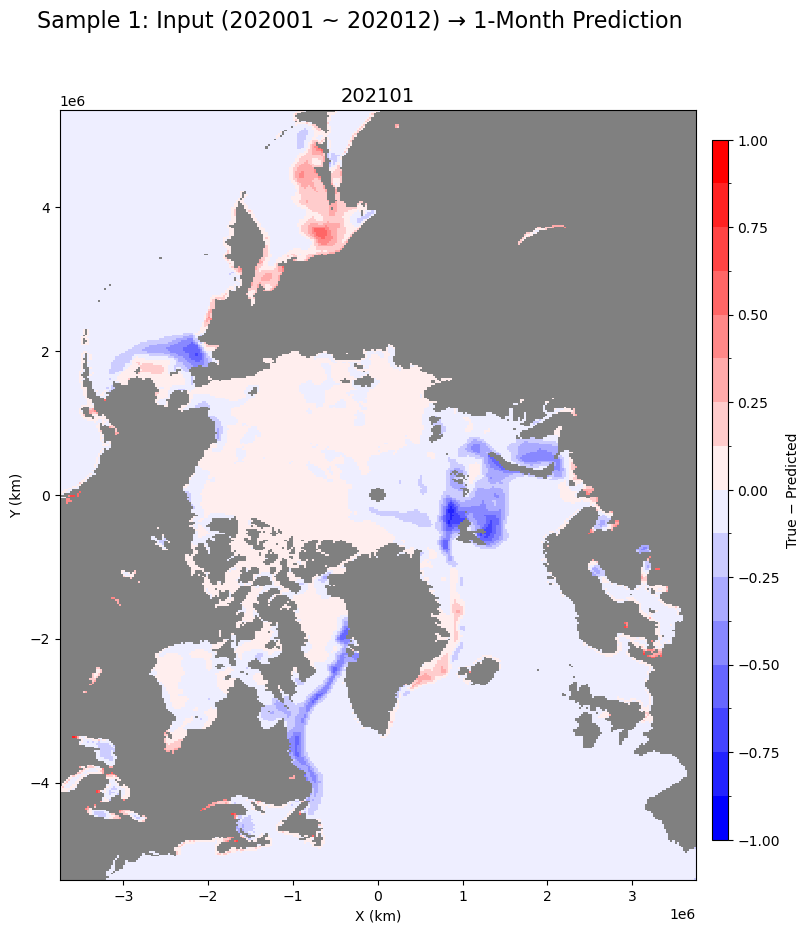
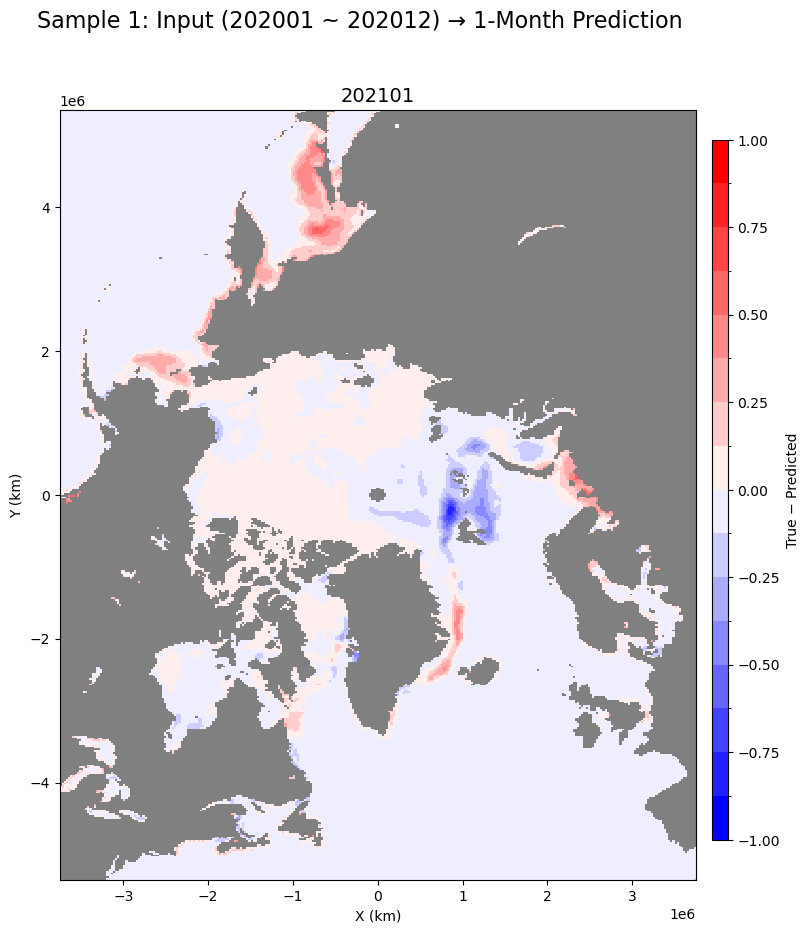
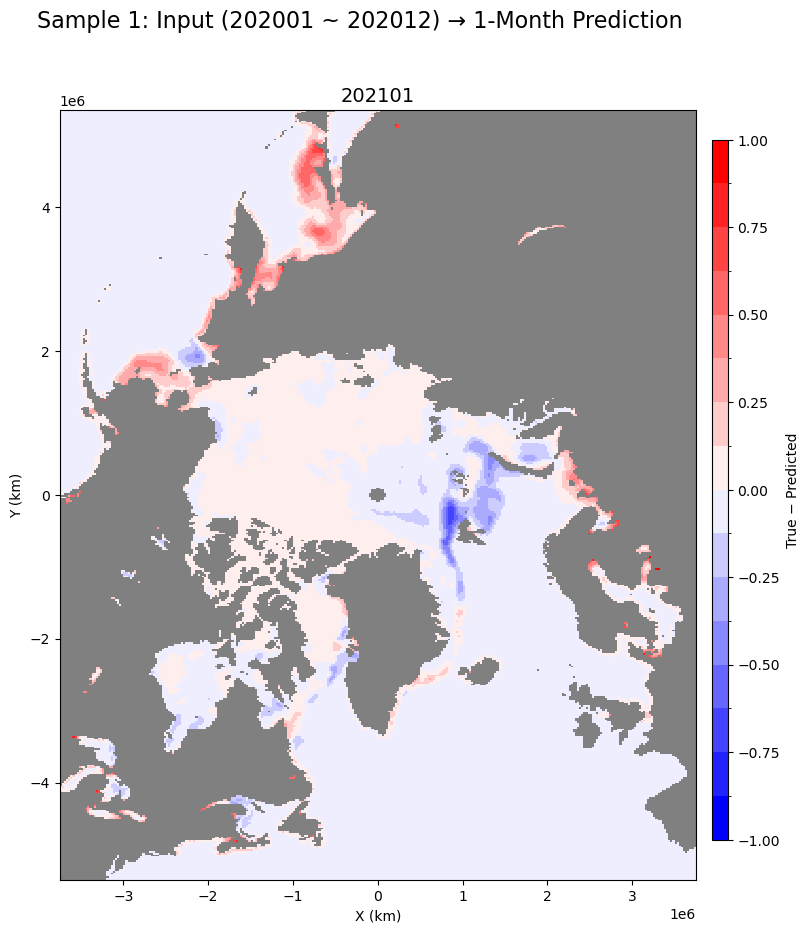

# SIC-Prediction
# 산지니 조
- DS 대학원 2025-1 딥러닝 프로젝트
---
## 주제: Spatio-Temporal Forcasting Monthly Arctic sea ice concentration
- Data Source: 
    - ERA5 monthly averaged data on single levels from 1940 to present ([https://cds.climate.copernicus.eu/datasets/reanalysis-carra-single-levels?tab=overview](https://cds.climate.copernicus.eu/datasets/reanalysis-era5-single-levels-monthly-means?tab=overview))
    - NSIDC Sea Ice Concentrations from Nimbus-7 SMMR and DMSP SSM/I-SSMIS Passive Microwave Data, Version 2 (https://nsidc.org/data/nsidc-0051/versions/2)
- Data Range: 1995/01/01 ~ 2024/12/31
- Using Variables
    - 10m u component of wind
    - 10m v component of wind
    - 2m temperature
    - Mean sea level pressure
    - Total precipitation
    - Sea surface temperature (Delete)
    - Surface sensible heat flux
    - Snow albedo
    - Snowmelt
    - Total cloud cover
    - Total column water vapour
- Our Model Architecture


- Results [All results images exist in folder 'results']


Input Climate Variable

Input only the past SIC variable

Input Climate + SIC variable


---
# 실행 방법
1. 다음과 같이 가상환경 생성
```
conda create -n sic python==3.11.11
```
2. Repository를 Clone
```
git clone [해당 Repository 주소]
```

3. requirements.txt 설치
```
pip install -r requirements.txt
```
4. 기존의 기후 변수 전처리 파일 download / 직접 원본 데이터 다운로드 후 Climate_variable_Preprocessing.ipynb 실행
- 전처리 완료 파일 다운로드 링크: (https://www.dropbox.com/scl/fi/179413qvyenr4fxqr9yli/feature_real_final.npz?rlkey=b18ycpier7iifl5v8j24if7ge&st=4q31ru01&dl=0)

5. main.py를 실행